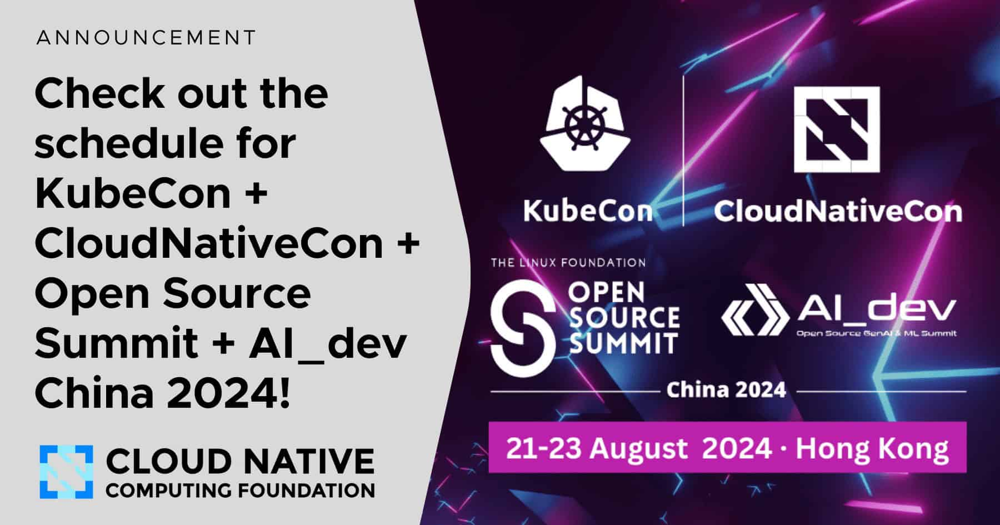

  
  

# Google Summer of Code (GSoC) 2024 Final Report

**Contributor:** [Zhe Shen](https://github.com/z1ens)  
**Organization:** [Cloud Native Computing Foundation (CNCF)](https://www.cncf.io)  && [Open-Cluster-management](https://open-cluster-management.io)  
**Project:** [[GSoC 2024]Scheduling AI Workload Among Multiple Clusters](https://github.com/open-cluster-management-io/ocm/issues/369)

## TL;DR

Hello! I'm Zhe Shen, and this is my first time participating in [Google Summer of Code](https://summerofcode.withgoogle.com). I'm honored to have been selected as a contributor by the [Cloud Native Computing Foundation](https://www.cncf.io) to work with [Open-Cluster-Management](https://open-cluster-management.io).

Over these three months, I've delved deeply into the challenges of efficiently managing AI/ML workloads across multiple clusters—a task that is increasingly critical in the era of AI-driven applications. I'm pleased to report that I've successfully completed the project, which included:

1. Developing a GPU/TPU Resource Usage Collection Addon
2. Writing a comprehensive proposal for an external Kueue Admission Check Controller

This experience has been invaluable, enhancing my skills in cloud-native technologies, open-source contribution, and more importantly, in the optimization of AI/ML workload scheduling, which is increasingly becoming a focal point in both industry and research.

- **Key Links**:
  - [[PR]GPU/TPU-resource-usage-collect-addon #20](https://github.com/open-cluster-management-io/addon-contrib/pull/20)
  - [[PR]OCM Kueue Admission Check Controller](https://github.com/open-cluster-management-io/ocm/pull/601)
  - [[Demo]Open Cluster Management - AI Workload Scheduling Addon](https://www.youtube.com/watch?v=b9h-uwZw7jA&t=310s)
  - [[Demo]Open Cluster Management - AI Workload Scheduling with Kueue as External Admission Check Controller](https://www.youtube.com/watch?v=mFRGAbGFPV0&t=414s)

## KubeCon + CloudNativeCon + Open Source Summit China 2024 Contribution

I'm thrilled to announce that my GSoC project has become an integral part of two significant presentations at the [KubeCon + CloudNativeCon + Open Source Summit China 2024 in Hong Kong](https://events.linuxfoundation.org/kubecon-cloudnativecon-open-source-summit-ai-dev-china/). This inclusion underscores the relevance and impact of our work on AI workload scheduling in multi-cluster environments.
The two relevant topics being demonstrated at this prestigious event are:

1. [Boundaryless Computing: Optimizing LLM Performance, Cost and Efficiency in Multi-Cloud Architecture](https://kccncossaidevchn2024.sched.com/event/1eYXG/boundaryless-computing-optimizing-llm-performance-cost-and-efficiency-in-multi-cloud-architecture-yi-dui-dou-zhao-daepnano-llmxia-reyi-jian-zhu-red-hat-kai-zhang-alibaba-cloud-intelligence)
This presentation focuses on optimizing Large Language Model (LLM) performance, cost, and efficiency across multi-cloud architectures. Our work on GPU/TPU resource usage collection and intelligent workload scheduling directly contributes to this goal, enabling more efficient utilization of resources for AI workloads.

2. [Connecting the Dots: Towards a Unified Multi-Cluster AI/ML Experience](https://kccncossaidevchn2024.sched.com/event/1eYXc/connecting-the-dots-towards-a-unified-multi-cluster-aiml-experience-pu-daepyu-ni-zha-zhong-shi-aimlmo-qing-hao-redhat-chen-yu-microsoft?iframe=no&w=100%25&sidebar=yes&bg=no)
This session aims to create a unified multi-cluster AI/ML experience, which aligns perfectly with our project's objectives. Our GPU/TPU Resource Usage Collect Addon and the proposed OCM Kueue Admission Check Controller are key components in achieving this unified experience, facilitating seamless AI/ML workload management across multiple clusters.

The inclusion of our work in these presentations at such a prominent event validates the importance and timeliness of our GSoC project. It demonstrates that our efforts are not just academic exercises but are addressing real-world challenges in cloud-native AI/ML deployments. This recognition provides an excellent opportunity for our work to reach a wider audience and potentially influence future developments in multi-cluster AI workload management.

## Background

[Open Cluster Management (OCM)](https://open-cluster-management.io) is a [CNCF](https://www.cncf.io) project focused on Multi-Cluster and Multi-Cloud management for Kubernetes applications. It offers open APIs for cluster registration, workload distribution, and dynamic placement of policies and workloads. The placement concept in OCM enables developers to deploy workloads dynamically across clusters based on resource availability, such as memory and CPU. However, as AI/ML workloads increasingly rely on specialized hardware like GPUs and TPUs, optimizing their scheduling across clusters becomes vital for performance and efficiency.

### Project Overview

This project enhances OCM to optimize AI/ML workload scheduling across multiple Kubernetes clusters by focusing on GPU/TPU resource utilization—-key elements that drive modern AI applications.

The key components include:

1. GPU/TPU Resource Usage Collect Addon:

- This addon extends OCM’s `Placement` strategy by enhancing the `AddonPlacementScore` to evaluate GPU/TPU resources within cluster sets. By incorporating these specialized resources into the scheduling decision process, AI workloads can be more effectively distributed to clusters that meet their specific hardware requirements. This is crucial for AI/ML workloads, which demand high computational power and efficient resource management.

2. OCM Kueue Admission Check Controller:

- I deliver a proposal for the external [Kueue Admission Check controller](https://kueue.sigs.k8s.io/docs/admission-check-controllers/provisioning/) which integrates OCM `Placement` results with [MultiKueue](https://kueue.sigs.k8s.io/docs/concepts/multikueue/). The controller interprets OCM `Placement` decisions to generate corresponding `MultiKueueConfig` and `MultiKueueCluster` resources, facilitating a streamlined setup of the [MultiKueue](https://kueue.sigs.k8s.io/docs/concepts/multikueue/) environment. This allows users to select clusters based on custom criteria, making AI/ML workload scheduling more responsive and aligned with the specific demands of these workloads.

These components are designed to significantly improve the scheduling and resource efficiency of AI/ML workloads, ensuring that they are deployed to clusters with the necessary GPU/TPU resources. This work not only enhances OCM’s capabilities but also positions it as a critical tool in the AI/ML ecosystem, where optimized resource management can lead to substantial performance gains.

## Work Completed

### Deliverables

- GPU/TPU Resource-Usage-Collect-Addon
- Proposal of the OCM Kueue Admission Check Controller
- Demonstration of both contributions in OCM community meetings.

## Roadmap

### Phase 1: Understanding and Enhancing Resource Usage Collection

- **Environment Setup**:
  - Set up a local Kubernetes (Kind) cluster capable of running GPU pods.
  - Ensure the cluster is configured to expose the information of the `gpu-node`.

- **Install OCM**:
  - Set up the Open-Cluster-Management (OCM) environment.

- **Learn OCM Architecture**:
  - Deep dive into the architecture of OCM, focusing on:
    - The "hub-kubelet" mode.
    - The concept of `Placement`.
    - The workflow of `Addon` components.
    - The enhancement in using `AddonTemplate`.

- **Study AddOnPlacementScore**:
  - Understand the `AddOnPlacementScore` API and how it integrates with OCM's scheduling mechanism.

- **Analyze Existing Resource Usage Collect Addon**:
  - Review the workflow and scoring mechanism of the current resource usage collect addon.
  - Explore the existing method for resource collection and scoring.

- **Extend to GPU and TPU Resource Collection**:
  - Research and implement methods to collect GPU and TPU resource usage.
  - Develop and integrate scoring mechanisms for these resources, crucial for AI/ML workloads that rely on these specialized hardware accelerators.

- **Develop Addon with `AddonTemplate` Mode**:
  - Refactor the addon using the new `AddonTemplate` mode to enhance code cleanliness and maintainability.
  - Ensure the new template structure aligns with best practices and OCM's extensibility features.

- **Develop New Scoring Mechanisms**:
  - Implement a **Node Scope Score** to evaluate resources at the node level, particularly focusing on GPU/TPU resources.
  - Implement a **Cluster Scope Score** to ensure resources are efficiently and reasonably scheduled across clusters, optimizing AI/ML workload performance.

- **Community Engagement**:
  - Present my progress and contributions in OCM community meetings.
  - Demonstrate the enhanced resource usage collect addon with GPU/TPU support, showcasing its impact on AI/ML workload scheduling.

### Phase 2: Integrating MultiKueue and Kueue

- **Set Up MultiKueue Environment**:
  - Prepare and configure a MultiKueue environment.

- **Research Kueue and MultiKueue Mechanisms**:
  - Study the workflow and internal mechanisms of Kueue and MultiKueue.
  - Understand their interaction with job scheduling and resource allocation, particularly in the context of AI/ML workloads.

- **Proposal Development**:
  - Draft and deliver a proposal for an OCM Kueue Admission Check Controller.

- **Integrate OCM with MultiKueue**:
  - Integrate the OCM `Placement` results with MultiKueue.
  - Utilize the `AddOnPlacementScore` from the resource usage collect addon to dynamically adjust job dispatching in MultiKueue, ensuring that AI/ML workloads are scheduled to clusters with the necessary GPU/TPU resources.

- **Final Demonstration**:
  - Showcase the integrated solution and its effectiveness in an OCM community meeting, emphasizing its benefits for AI/ML workload scheduling.

## Current State

- **Pull Request Status**:
- [Pull request](https://github.com/open-cluster-management-io/addon-contrib/pull/20) for the `GPU/TPU-Resource-usage-collect-addon`, all core functionalities have been implemented, and will be merged to [addon-contrib](https://github.com/open-cluster-management-io/addon-contrib).
- [Pull request](https://github.com/open-cluster-management-io/ocm/pull/601) for OCM Kueue Admission Check Controller proposal. The proposal has undergone an initail review, and will be merged to [ocm-io/solution](https://github.com/open-cluster-management-io/ocm/tree/main/solutions).

- **Community Demo**:
- The `GPU/TPU-resource-usage-collect-addon` has been demonstrated in a community demo on 5th July, and the recording is available on YouTube [here](https://www.youtube.com/watch?v=b9h-uwZw7jA&t=310s).
- The `OCM Admission Check Controller` was also presented during the OCM community meeting on 16th August, and the recording is available on YouTube [here](https://www.youtube.com/watch?v=mFRGAbGFPV0&t=414s).

## Future Work

Looking ahead, the next steps for the GPU/TPU Resource Usage Collect Addon involve incorporating feedback from the community and extending its functionality to cover a wider range of AI/ML workload scenarios. By refining the addon to consider more diverse use cases, we aim to make it a robust tool for AI workload deployment in multi-cluster environments, ensuring that the scheduling process remains efficient and responsive to the unique demands of AI/ML applications.

Similarly, for the Kueue Admission Check Controller, future work will focus on addressing the feedback received and exploring additional integrations with other AI/ML scheduling frameworks. The goal is to make the controller more versatile and capable of handling a broad spectrum of AI/ML workloads, further solidifying OCM's role in the AI/ML ecosystem.

## Challenges & Learnings

### Mentorship and Guidance

- **Role of Mentors**: I am immensely grateful to my mentors, [Qing Hao](https://github.com/haoqing0110) and [Jian Qiu](https://github.com/qiujian16). Particularly Qing Hao, who has been instrumental in guiding me through every detail of this project. Her support has been not just technical but also emotional, offering congratulations after successful demos and reassurance during challenges.

### Problem-Solving Approach

- **Initial Struggles**: Early in my GSoC journey, I often tried to solve issues independently, leading to frustration and I found out that I was always stuck somewhere.

- **Learning to Collaborate**: I realized the value of consulting my mentors and discussing problems with the community, which often led to quick resolutions. This experience taught me the importance of seeking guidance from experts and engaging more with the community.

### Growth Through Challenges

- **Embracing Failure**: I learned that failure is a part of growth. During a recent demo, I faced a minor issue that initially made me very nervous. However, my mentors and the host reassured me, which helped me see that mistakes are opportunities to learn, not failures.

- **Developing Composure**: This experience also highlighted the importance of maintaining composure during important presentations. I learned to stay calm, present my points clearly, and then return to address any issues.
